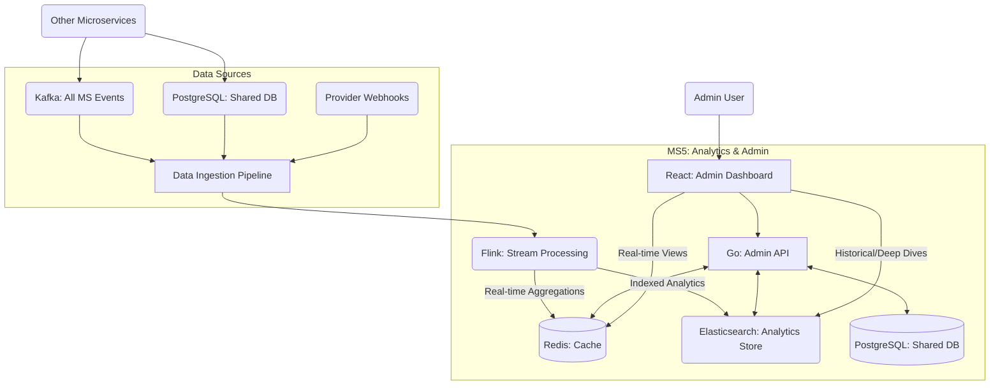

Analytics and Administration Microservice Documentation
# Introduction
This document details the design and implementation of the Analytics and Administration Microservice (Microservice 5), a critical component of NOTLI's highly scalable notification system. This service provides real-time insights and administrative control across the entire notification pipeline, with detailed metrics for each channel, comprehensive analytics on millions of notification events per minute, and a modern administration interface for system management. It integrates data from all previous microservices (delivery status from Microservice 4, prioritization from Microservice 3, content analysis from Microservice 2, and user data from Microservice 1), using a stream-processing architecture with Apache Kafka and Apache Flink for real-time analysis. The sophisticated dashboard provides visibility into system health, notification performance, and user engagement, while offering powerful administration tools for managing the entire notification ecosystem.

# Requirements
- **Real-Time Analytics**: Process and analyze millions of notification events per minute with sub-second latency:
  - **Delivery Performance**: Success rates, bounce rates, delivery times across all channels
  - **Channel Performance**: Comparative metrics between email and future channels
  - **User Engagement**: Opens, clicks, responses, and conversion tracking
  - **System Health**: Component performance, error rates, and bottlenecks
  - **Content Analysis**: Bad language detection, spam patterns, and security threats
- **Cross-Channel Analytics**: Unified view across current and future notification channels (email, SMS, push, etc.)
- **Administrative Interface**: Comprehensive web dashboard for:
  - **User Management**: Manage accounts, API keys, and rate limits
  - **Template Management**: View, edit, and test notification templates
  - **Dead Letter Management**: View, retry, and analyze failed messages
  - **System Configuration**: Manage system settings and scaling parameters
  - **Provider Management**: Monitor and configure delivery providers
- **Elastic Scalability**: Support processing 50,000+ events per second with horizontal scaling
- **Multi-Dimensional Data Analysis**: Custom reporting with drill-down capabilities
- **Data Integration**: Consume data from all system sources:
  - PostgreSQL (delivery status, user data)
  - Kafka (real-time events from all microservices)
  - Elasticsearch (logs and error data)
  - Redis (cached metrics and system state)
- **Reliability**: Ensure analytics accuracy with redundancy and data reconciliation
- **Extensibility**: Support easy addition of new metrics, channels, and administrative features

# Architecture Overview
The Analytics and Administration Microservice implements a multi-layered architecture:

## High-Level Architecture


## Key Components
1. **Data Ingestion Pipeline**: 
   - Kafka consumers for all notification events
   - Database connectors for historical data
   - Custom webhook receivers for provider callbacks

2. **Stream Processing Engine**:
   - Apache Flink for real-time analytics
   - Complex event processing for pattern detection
   - Aggregation and windowing for metrics calculation

3. **Analytics Storage**:
   - Elasticsearch for indexed analytics data
   - Time-series optimization for performance metrics
   - Multi-dimensional indexing for flexible queries

4. **Administration Backend**:
   - Go-based REST API services
   - Role-based access control
   - Secure administrative operations

5. **Dashboard Frontend**:
   - React with Tailwind CSS
   - Real-time visualization components
   - Responsive design for desktop and mobile

6. **Distributed Cache**:
   - Redis for frequently accessed metrics
   - Cached dashboard queries
   - System state information

# Technology Stack
- **Backend Processing**: 
  - Apache Flink for stream processing (Java/Scala)
  - Go for API services and administration backend
- **Message Queue**: Apache Kafka for real-time data ingestion
- **Frontend**: 
  - React with Tailwind CSS for the dashboard
  - Chart.js and D3.js for visualizations
- **Databases**:
  - PostgreSQL (shared) for historical data and user management
  - Elasticsearch for analytics storage and search
  - Redis for caching and real-time metrics
- **Container Orchestration**: 
  - Kubernetes with Horizontal Pod Autoscaling (HPA)
  - Custom scaling metrics based on event processing rates
- **Libraries**:
  - Flink: Apache Flink Java/Scala SDK with custom operators
  - Go: github.com/confluentinc/confluent-kafka-go, github.com/go-redis/redis/v8
  - Frontend: React Query, React Router, Recharts

## Why Flink and Go?
- **Flink**: Provides industry-leading stream processing capabilities:
  - Stateful processing with exactly-once semantics
  - Sub-second latency for real-time analytics
  - Windowing operations for time-based metrics
  - Horizontal scalability for processing millions of events
  - Rich ecosystem of connectors and operators

- **Go**: Handles the administration backend with exceptional performance:
  - High-throughput API endpoints
  - Efficient connection handling for many concurrent dashboard users
  - Strong typing for API contracts
  - Excellent integration with Kafka, Redis, and Elasticsearch

- **React with Tailwind**: Delivers a modern, responsive dashboard:
  - Component-based architecture for maintainability
  - Real-time updates with WebSockets
  - Responsive design works across devices
  - Fast rendering for complex visualizations

# Analytics Capabilities
## Real-Time Metrics Dashboard
The analytics engine processes these key metrics in real-time:

### Delivery Performance (All Channels)
- Success Rate: Percentage of successfully delivered notifications
- Bounce Rate: Hard and soft bounces with categorization
- Delivery Time: Time from submission to delivery
- Provider Performance: Comparison between delivery providers

### Channel-Specific Analytics
#### Email Channel
- Open Rate: Percentage of opened emails
- Click-Through Rate: Percentage of emails with clicked links
- Spam Report Rate: Percentage reported as spam
- Domain Performance: Delivery success by recipient domain

#### SMS Channel (Ready for Implementation)
- Delivery Rate: Successful SMS deliveries
- Delivery Receipts: Confirmed deliveries
- Response Rate: Replies received
- Cost Analysis: Per-message delivery costs

#### Push Notification Channel (Ready for Implementation)
- Delivery Rate: Successfully delivered push notifications
- Open Rate: User interactions with notifications
- Time-to-Open: Time between delivery and user interaction
- Opt-Out Rate: Users disabling notifications

### User Engagement
- Notification Frequency: Notifications per user
- Engagement Over Time: Trends in user interaction
- Conversion Tracking: Actions taken after notification
- Opt-Out Analytics: Patterns in unsubscribe behavior

### System Health
- Component Performance: Processing times by microservice
- Error Rates: Failures by type and component
- Scaling Events: Automatic scaling trigger analytics
- Queue Depths: Kafka topic monitoring

## Multi-Dimensional Analysis
The analytics system supports complex queries across multiple dimensions:

```scala
// Example Flink job for multi-dimensional analysis
val deliveryStream = env.addSource(kafkaConsumer)
  .map(json => parseDeliveryEvent(json))

// Channel performance comparison
val channelPerformance = deliveryStream
  .keyBy(event => (event.channel, event.getHourTimestamp))
  .window(TumblingEventTimeWindows.of(Time.hours(1)))
  .aggregate(new SuccessRateAggregator())

// User segment analysis
val userSegmentPerformance = deliveryStream
  .join(userDataStream)
  .where(event => event.userId)
  .equalTo(userData => userData.userId)
  .window(TumblingEventTimeWindows.of(Time.days(1)))
  .apply(new UserSegmentAnalysis())

// Template performance analysis
val templatePerformance = deliveryStream
  .keyBy(event => event.templateId)
  .window(SlidingEventTimeWindows.of(Time.days(7), Time.days(1)))
  .aggregate(new TemplatePerformanceAggregator())

// Export to Elasticsearch for visualization
channelPerformance.addSink(elasticsearchSink)
userSegmentPerformance.addSink(elasticsearchSink)
templatePerformance.addSink(elasticsearchSink)
```

# Administration Interface
## Dashboard Features
The administrative dashboard provides comprehensive system management:

### User Management
- Account creation and management
- API key administration with channel-specific permissions
- Rate limit configuration
- Usage monitoring and quotas

### Template Management
- Template creation and editing with preview
- Version control and A/B testing capabilities
- Performance analytics by template
- Template validation across channels

### Dead Letter Queue Management
- View failed notifications with error details
- Retry capabilities with custom parameters
- Batch operations on failed messages
- Error pattern analysis

### System Configuration
- Provider configuration management
- Scaling parameters and thresholds
- Rate limiting rules
- Feature flags and system settings

### Analytics Exploration
- Custom report builder
- Scheduled reports and exports
- Alert configuration
- Anomaly detection settings

## Administration API
The RESTful API provides programmatic access to administrative functions:

```go
// Example Go API for dead letter queue management
func (s *AdminService) HandleReprocessDeadLetter(w http.ResponseWriter, r *http.Request) {
    // Extract notification ID from request
    vars := mux.Vars(r)
    id := vars["id"]

    // Validate permissions
    if !s.hasAdminPermission(r) {
        http.Error(w, "Unauthorized", http.StatusUnauthorized)
        return
    }
    
    // Retrieve dead letter message
    notification, err := s.deadLetterRepo.GetByID(r.Context(), id)
    if err != nil {
        http.Error(w, "Failed to find notification", http.StatusNotFound)
        return
    }

    // Republish to appropriate Kafka topic
    topic := "distributed-notifications"
    err = s.kafkaProducer.Produce(&kafka.Message{
        TopicPartition: kafka.TopicPartition{Topic: &topic, Partition: kafka.PartitionAny},
        Value:          notification.Data,
        Headers:        notification.Headers,
    }, nil)
    
    if err != nil {
        http.Error(w, "Failed to reprocess", http.StatusInternalServerError)
        return
    }
    
    // Record admin action
    s.recordAdminAction(r, "reprocess_dead_letter", id)
    
    w.WriteHeader(http.StatusOK)
    json.NewEncoder(w).Encode(map[string]string{
        "status": "reprocessing initiated",
        "id":     id,
    })
}
```

# Dashboard UI Implementation
The React-based dashboard features a modern, responsive design:

```jsx
// Dashboard component with real-time metrics
const DeliveryDashboard = () => {
  const [metrics, setMetrics] = useState({ 
    successRate: 0, 
    channels: { email: {}, sms: {}, push: {} } 
  });
  const [timeframe, setTimeframe] = useState('1h');
  
  // Real-time metrics subscription
  useEffect(() => {
    const socket = new WebSocket('wss://api.notli.com/metrics/live');
    
    socket.onmessage = (event) => {
      const data = JSON.parse(event.data);
      setMetrics(data);
    };
    
    return () => socket.close();
  }, [timeframe]);
  
  return (
    <div className="grid grid-cols-1 md:grid-cols-2 lg:grid-cols-3 gap-4">
      {/* Overall success rate */}
      <MetricCard 
        title="Overall Delivery Success Rate" 
        value={`${(metrics.successRate * 100).toFixed(2)}%`}
        trend={metrics.successRateTrend}
      />
      
      {/* Channel-specific metrics */}
      {Object.entries(metrics.channels).map(([channel, data]) => (
        <ChannelMetricCard 
          key={channel}
          channel={channel}
          metrics={data}
        />
      ))}
      
      {/* Detailed charts */}
      <div className="col-span-1 md:col-span-2 lg:col-span-3">
        <DeliveryTimelineChart 
          data={metrics.timeline} 
          timeframe={timeframe}
          onTimeframeChange={setTimeframe}
        />
      </div>
    </div>
  );
};
```

# Scalability and Performance
## Elastic Scaling Architecture
The analytics system scales elastically to handle extreme event loads:

1. **Flink Job Parallelism**:
   - Dynamic parallelism based on event rate
   - Kubernetes-based autoscaling of TaskManagers
   - Checkpointing for fault tolerance

2. **Kafka Partition Management**:
   - Optimal partition count for throughput
   - Consumer group balancing
   - Partition reassignment during scaling

3. **Multi-Tier Storage**:
   - Hot metrics in Redis
   - Warm data in Elasticsearch
   - Cold data in object storage with retention policies

4. **Compute Resource Optimization**:
   - CPU-optimized instances for Flink processing
   - Memory-optimized instances for Elasticsearch
   - Cost-efficient scaling based on workload patterns

## Performance Benchmarks
The system delivers exceptional performance at scale:

| Component | Metric | Value |
|-----------|--------|-------|
| Data Ingestion | Max events/second | 50,000+ |
| Stream Processing | Processing latency | 200-500ms |
| Query Performance | P95 dashboard load time | <1.5s |
| Storage Capacity | Events per day | 4+ billion |
| Concurrent Users | Dashboard users | 500+ |

# Future Channel Expansion
## Analytics Architecture for New Channels
The analytics system is designed for seamless addition of new channels:

1. **Channel Registry**:
   - Central configuration for channel properties
   - Metric definitions per channel
   - Dashboard component mappings

2. **Channel-Agnostic Processing**:
   - Common event schema with channel-specific extensions
   - Unified success/failure definitions
   - Consistent time tracking across channels

3. **Visualization Components**:
   - Reusable UI components for channel metrics
   - Comparison views between channels
   - Channel-specific detail pages

## Channel Addition Process
Adding analytics for a new channel involves:

1. Define channel-specific event schema
2. Create Flink operators for channel-specific metrics
3. Add Elasticsearch mappings for new channel data
4. Implement channel-specific dashboard components
5. Update cross-channel comparison views

# Disaster Recovery and Data Integrity
## High Availability Design
- **Redundant Processing**: Multiple Flink job instances
- **Data Replication**: Kafka and Elasticsearch replication
- **Stateful Recovery**: Checkpointing and savepoints for Flink jobs
- **Regional Failover**: Multi-region deployment options

## Data Reconciliation
To ensure accurate analytics despite potential failures:

1. **Event Deduplication**: Unique event IDs prevent double-counting
2. **Delayed Aggregation**: Wait for late-arriving events
3. **Backfilling**: Repair missing data from source systems
4. **Consistency Checks**: Regular validation against source data

# Conclusion
The Analytics and Administration Microservice completes NOTLI's highly scalable notification system with comprehensive visibility and control. Its real-time processing capabilities, multi-channel analytics, and powerful administration tools ensure optimal system performance while providing actionable insights. The service's elastic scaling architecture enables it to handle millions of events per minute while maintaining sub-second processing times, and its extensible design supports seamless addition of new channels as NOTLI expands beyond email.

Key Citations:
- [Apache Flink Documentation](https://flink.apache.org/docs/latest/)
- [Elasticsearch Guide](https://www.elastic.co/guide/index.html)
- [React Documentation](https://reactjs.org/docs/getting-started.html)
- [Kafka Documentation](https://kafka.apache.org/documentation/)
- [Go Documentation](https://golang.org/doc/)
- [Kubernetes Autoscaling](https://kubernetes.io/docs/tasks/run-application/horizontal-pod-autoscale/)
